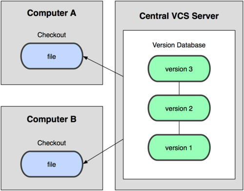

Version Control System(VCS)
=============

## VCS란?
* VCS란 위의 설명처럼 Version Control System의 약자로써 파일의 변화를 시간과 버전으로 관리하여 이후에 특정 시점에서
해당 버전을 다시 꺼내올 수 있는 관리 시스템을 말한다. 소스코드 뿐만이 아니라 이미지, 일반 파일 등 모든 파일들도 버전과 시간으로
관리가 가능하다.

* 기본적으로 3가지(로컬, 중앙집중식, 분산)의 VCS방식이 있으며 대표적인 예가 Git, svn이 있다.

#### 로컬 버전 관리 시스템(Local VCS)이란?
* 버전을 관리하기 위해서 디렉토리를 통해서 파일을 복사하는 방법을 말한다. 흔히 로컬에서 버전에 시간에 따라서 프로젝트의 디렉토리를 
다르게 사용하는 방식으로 가장 간편하지만 위험성도 높다. 예로 로컬에서만 프로젝트를 관리하기 때문에 버전의 파일이 실수로 삭제되거나
유실될 시에 해당 버전으로 되돌아 가거나 bug-tacking을 하기에도 쉽지 않다.

출처 : <http://flowerykeyboard.tistory.com/1>

* 위의 그림처럼 로컬 내부에서 버전을 관리하는 데이터베이스를 생성하고 프로젝트를 버전에 따라서 저장하여 관리하는 방식을 
사용하였다. 가장 대표적인 Local-VCS로는 RCS가 있다.

#### 중앙 집중식 버전관리 시스템(CVCS)

* 프로젝트를 혼자가 아닌 다수의 사람들과 함께 해야 하는 경우 파일을 관리하는 서버를 별도로 두고 각 클라이언트들은 
중앙 관리 서버에서 파일을 다운로드해서 로컬에서 작업을 할 수 있도록 하는 VCS방식을 말한다.

* 중앙 관리 서버에서 해당 프로젝트의 모든 파일들을 버전에 따라서 관리하기 때문에 누가 어떤 작업을 했는지에 대한 tracking이 쉽고 
로컬에서 해당 작업에 문제가 생기게 되더라도 원본 파일은 중앙 관리 서버에 있기 때문에 손쉬운 롤백이 가능하다.

* 다만 단점으로는 중앙 관리 서버가 문제가 생겨서 다운되는 경우 작업을 하는 모든 클라이언트들 역시 작업을 할 수 없으며
원본 파일은 중앙 관리 서버 한대에서 모두 일괄적으로 관리되기 때문에 파일이 서버에서 유실되거나 삭제될 시 되돌릴 수 있는 방법이 없다는
단점은 치명적이라고 생각한다.

