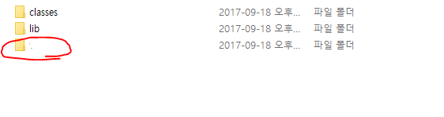

WEB-INF와 WEB 보안상의 이유.
=============

## WEB-INF란
* WEB-INF란 Web-information의 약자
* 웹 어플리케이션에서 필요한 설정파일이나 클래스 파일, 라이브러리를 포함한 각종 리소스들을 관리하는 
디렉토리 구조이다.

* 위의 사진은 프로젝트를 maven으로 관리를 해서 배포하게 되면 확인할 수 있는 WEB-INF의 기본적인 디렉토리 구조이다.
classes에는 maven을 이용하여 컴파일된 java의 class파일들이 들어있으며 lib에는 해당 프로젝트에서 사용한 라이브러리들,
붉은 색으로 되어 있는 디렉토리는 실제 view와 관련된 파일들이 들어가 있다.

* 따라서 WEB-INF를 들어가서 확인하게 되면 웹 어플리케이션의 로직, 페이지, 디렉토리 구조까지 모두 다 파악할 수 있기 때문에
보안상의 이슈로 servlet의 action(Controller의 viewResolver 접근도 servlet의 액션이기 때문에 포함하여)을 통해서 접근하는
경우를 제외하고 모든 외부에서의 접근은 막혀있다.

* classes와 lib까지는 이해하겠다. 하지만 왜 jsp와 html과 같은 정적 파일도 WEB-INF 안에 관리를 해야만 하는걸까..라는 의문이 들 수 있다.
하지만 jsp의 특성상 java코드가 들어갈 수 있고(현재는 지양하고 있다만) jstl과 같은 태그를 이용한다고 하더라도 비지니스 로직이나
model혹은 dto의 멤버들이 노출될 수 있기 때문에 보안상으로 지켜야 하는 목록인 것은 분명할 것이다.

* 리소스의 경우에는 약간의 예외사항이 생길 수 있다. 정적 자원을 관리하는 과정에서 WS(Web-Server 예를 들면 apache)를 사용하게 되는 경우
WEB-INF 안에 리소스 디렉토리를 넣는 경우에는 WS 역시 servlet이 아닌 외부에서 접근하는 것이기 떄문에 WEB-INF로의 접근 권한이 보안상의 이슈로
막혀있게 되고 그러면 WEB은 해당 정적 자원을 표현 하는 것이 불가능해 질 것이다. 이런 경우를 방지하고자 중요하지 않은 정적 자원은 WEB-INF안에
두지 않고 외부(정적 자원을 따로 관리하는 서버나 로컬의 다른 디렉토리 경로)로 따로 빼서 관리하는 경우가 일반적이다.

### 참고 문헌
 1. <http://www.jtmelton.com/2012/04/03/year-of-security-for-java-week-14-store-jsps-in-web-inf/>
 2. <https://wiki.apache.org/struts/StrutsCatalogHidingPagesUnderWEBINF>
