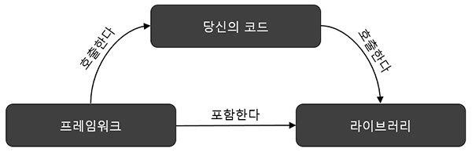

라이브러리와 프레임워크의 차이
=============

출처 <http://webclub.tistory.com/458>

## 라이브러리란
* 개발을 위한 기능을 모아놓은 도구들의 집합을 말하며 라이브러리를 사용하는 개발자에게 온전히 제어권을 가지고 있는 경우이다.

## 프레임워크란
* 프레임워크는 개발에 필요한 뼈대나 기반 구조를 이미 가지고 있는 것을 말하며 제어의 역전 개념이 적용된 기술이다.

* 개발에 필요한 많은 인터페이스들과 라이브러리들이 프레임워크에 들어가 있으며 개발자는 이런 인터페이스와 라이브러리를 사용하여
프로그램을 완성시켜야 하는 형태를 가지고 있다.

* 많은 인터페이스들과 라이브러리들이 존재하기 때문에 서로 다른 개발자들이 프레임워크를 통해서 동일한 환경을 구축하기가 매우 편리하며 
대부분의 대부분의 제어권을 개발자가 아닌 프레임워크가 관리하기 때문에 개발자는 제어를 위한 많은 고민을 하지 않아도 된다는 장점도 존재한다.

## 제어의 역전(IoC)이란?
* 제어의 역전은 IoC(Inversion of Control)의 약자로써 프로그램 내부에서 개발자가 관리해야만 하던 수 많은 제어의 권한을 
프레임워크에게 넘기는 것이다.

* 이는 또한 라이브러리와 프레임워크의 대표적인 차이점 중에 하나로 라이브러리를 사용하면 개발자가 라이브러리에서 미리 정의해 놓은
method를 호출해서 사용하지만 프레임워크에서 IoC가 발생하게 되면 개발자가 작성한 method를 프레임워크가 호출해서 사용하는 경우로
바뀌게 되는데 그의 대표적인 예가 handler이다. 프레임워크가 이미 가지고 있는 event-handler를 개발자는 직접 구현하지 않는다. 다만 
개발자는 해당 이벤트가 발생했을때 동작해야 하는 method만을 구현하고 프레임워크에게 그 내용을 알려준다. 그러면 프레임워크는 해당 이벤트가
발생하게 되는 경우에 개발자가 작성한 method를 호출하게 된다. 

* IoC의 대표적인 또 다른 예로는 프레임워크에 정의되어 있는 interface를 implements받아서 개발자가 직접 구현체를 개발한 후에 프레임워크에게
전달하는 방식이다. 이를 우리는 의존성 주입(Dependency Injection)이라고 표현한다.

참고 문헌
1. <http://vandbt.tistory.com/43>
2. <http://webclub.tistory.com/458>

